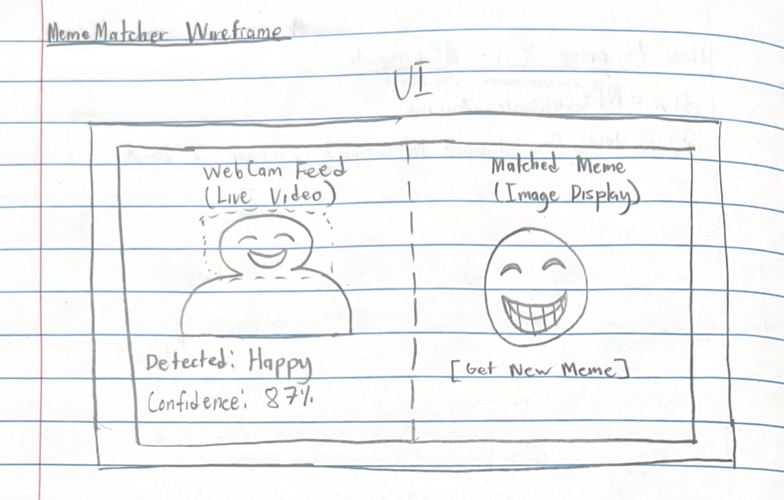

# OOP Nonwimp1 Project: MemeMatcher
John Puka & Ismail Qadiri
November 19, 2025

## 1. PROJECT SKETCH

### Goal
MemeMatcher detects facial emotions via webcam and displays matching humorous 
memes in real-time.

### Interaction Flow
1. User accesses a webcam
2. System analyzes facial expressions continuously  
3. Detects emotion (Happy, Sad, Angry, Surprised, Neutral, Confused)
4. Displays matching meme from curated collection
5. If time, user can request new memes or continue live detection

### Wireframe

## 2. TECHNOLOGY REQUIREMENTS / TECHNICAL RISKS

### Tech Stack
- **face-api.js** - Browser-based emotion detection (TensorFlow.js)
- **HTML5 getUserMedia** - Webcam access
- **JavaScript (ES6+)** - Application logic
- **CSS3** - Styling
- **Meme collection** - Images by emotion category

### Risks & Mitigation

**HIGH:**
1. **Emotion accuracy** - Confused/neutral overlap -> Reduce to 5 emotions if 
needed
2. **Load time** - 6-8MB, 5-10 sec -> Loading indicator + browser cache

**MEDIUM:**
3. **Webcam permissions** - May be denied -> Clear prompts, error handling
4. **Browser compatibility** - Old browsers unsupported -> 
Require Chrome/Firefox/Edge
5. **Lighting** - Affects accuracy -> User feedback, manual selection option
6. **Performance** - May lag -> Reduce to 2-3 FPS detection rate

**LOW:**
7. **HTTPS requirement** - Localhost works for dev
8. **Meme sourcing** - Doesn't affect core functionality

## 3. TECHNOLOGY FEASIBILITY TEST

### Goal
We will need to validate the face-api.js loads, webcam works, face detection 
functions, and emotions are extracted.

### Implementation
**Files:** feasibility_test.html, test_style.css, test_script.js

**Process:** Load models from CDN -> request webcam -> display video -> 
detect face every 300ms -> show emotions with confidence

### Next Steps
Curate memes (5-6 per emotion), implement display logic, add "Get New Meme" 
button, UI polish

## APPENDIX

### Files
- `feasibility_test.html`, `test_style.css`, `test_script.js`  
- Screenshot: [Showing webcam + detected emotion]

### Run Test
Open `feasibility_test.html` with Live Server (requires HTTPS/localhost)

### Design Documentation

**Inheritance:** None in feasibility test (functional JS). 
Full app: EmotionDetector -> FaceAPIDetector; MemeManager

**Aggregation:** MemeMatcher -> VideoStream, EmotionDetector, MemeDatabase, 
UIController

**Collaboration:** UIController uses EmotionDetector + MemeDatabase; 
EmotionDetector uses VideoStream

**Information Hiding:**  
- EmotionDetector: model loading, tensors, confidence  
- MemeDatabase: file paths, selection algorithm  
- VideoStream: getUserMedia details  
- UIController: DOM manipulation
